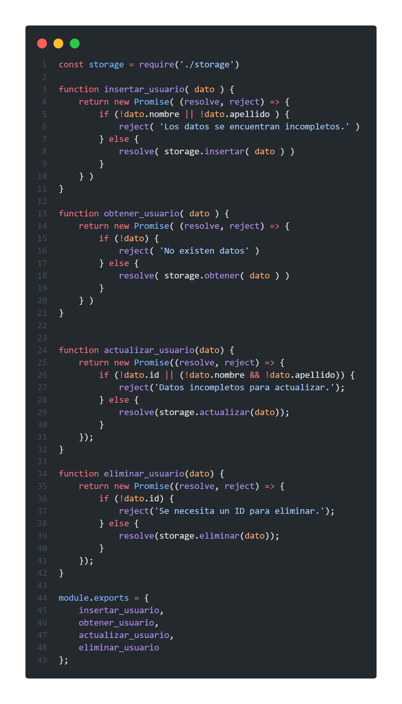
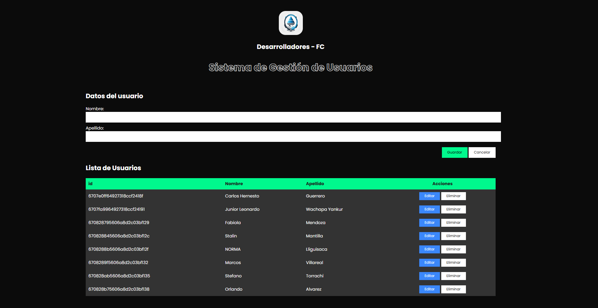

  

 

# Desarrolladores-Fc

## Integrantes:

- Diego Bonifaz
- Welligton Crespo
- Angel Delgado
- Paul Guzhñay
- Carlos Velasquez
- Junior Wachapa

# [U2 TALLER](u2_taller/)

Se integró los métodos PUT, DELETE

Se Implementó el frontend (HTML, CSS y JavaScript) para lo solicitado en el punto anterior.

 
 

